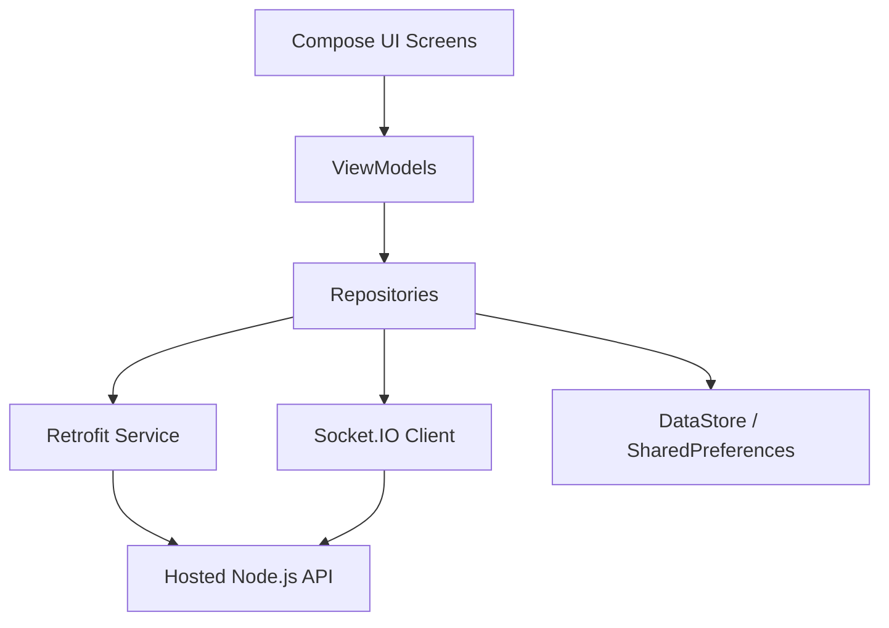

# Requirements

### Overview & Goals
The goal is to migrate the Manipai web application to a Native Android application while keeping the existing Node.js server as a hosted API. The new Android app will provide a modern, responsive user experience using Kotlin and Jetpack Compose, while maintaining feature parity with the web version, including real-time AI response streaming.

### Scope
- **In Scope**:
    - Creating a complete Native Android application using Kotlin.
    - Implementing Authentication (Login/Register).
    - Implementing Chat Conversations and Message history.
    - Implementing Real-time AI response streaming using Socket.IO.
    - Implementing User Settings and Statistics.
    - MVVM Architecture with Hilt for Dependency Injection.
- **Out of Scope**:
    - Modifying the existing Node.js server (assumed to be already hosted and compatible).
    - Web frontend updates.
    - Offline-first support (local message caching beyond the current session).

### User Stories
- **As a user**, I want to log in or register so that I can access my personalized chat history.
- **As a user**, I want to create and manage multiple chat conversations so that I can organize my AI interactions.
- **As a user**, I want to see AI responses stream in real-time so that I don't have to wait for the entire message to be generated.
- **As a user**, I want to view my usage statistics and change my app settings (theme, language).

# Technical Design

### Current Implementation
The current app is a Node.js Express application that:
- Uses an in-memory database for users, conversations, and messages.
- Provides REST API endpoints for Auth, Chat, and User data.
- Uses Socket.IO to stream AI responses from the Anthropic SDK (Claude) to the client.
- Has a vanilla JavaScript/HTML/CSS frontend.

### Proposed Changes
We will build a Native Android app that communicates with this backend.

#### Architecture
The app will follow the **MVVM (Model-View-ViewModel)** pattern with a repository layer for data handling.
- **UI Layer**: Jetpack Compose for declarative UI.
- **State Management**: ViewModels with `StateFlow` and Compose State.
- **Domain Layer**: Repository interfaces and Data Models.
- **Data Layer**: Retrofit for REST API and Socket.IO Java Client for real-time events.

#### Key Decisions
- **Dependency Injection**: **Hilt** will be used for managing dependencies (Retrofit, Repositories, ViewModels).
- **Networking**: **Retrofit** + **OkHttp** for standard API calls; **Socket.IO Client for Java** for streaming.
- **Local Storage**: **EncryptedSharedPreferences** for JWT tokens; **DataStore** for user preferences.
- **Navigation**: **Compose Navigation** to handle screen transitions.

### Data Models / Contracts
- `User`: `id`, `username`, `email`
- `Conversation`: `id`, `userId`, `title`, `createdAt`
- `Message`: `id`, `conversationId`, `role` (user/ai), `content`, `createdAt`
- `Settings`: `theme`, `language`, `notifications`

### Architecture Diagram


### File Structure
```text
android/
├── app/
│   ├── src/main/java/com/manipai/
│   │   ├── data/
│   │   │   ├── api/          # Retrofit interfaces
│   │   │   ├── models/       # Data classes
│   │   │   ├── repository/   # Repository implementations
│   │   │   └── socket/       # Socket.IO manager
│   │   ├── di/               # Hilt modules
│   │   ├── ui/
│   │   │   ├── auth/         # Login/Register screens
│   │   │   ├── chat/         # Conversation & Chat screens
│   │   │   ├── settings/     # Settings & Stats screens
│   │   │   └── theme/        # Compose Theme
│   │   └── MainActivity.kt
│   └── build.gradle
└── build.gradle
```

# Testing

### Validation Approach
Verification will be performed by running the Android app in an emulator and connecting it to the (locally running or hosted) Node.js server.

### Key Scenarios
- **Auth Flow**: Register a new user, log in, and ensure the token is saved.
- **Chat Flow**: Create a new conversation, send a message, and verify that the AI response streams in chunk by chunk.
- **Conversation Management**: Delete a conversation and ensure it disappears from the list.
- **Settings**: Change the theme in settings and verify it applies immediately.

### Edge Cases
- **Network Loss**: Ensure the app handles disconnection gracefully, especially during streaming.
- **Expired Token**: Verify that the app redirects to the login screen when the JWT expires.
- **Empty States**: Ensure appropriate UI for empty conversation lists or message histories.

# Delivery Steps

### ✓ Step 1: Initialize Android Project and Core Architecture
Initialize the Android project structure and configure core dependencies.

- Set up the Android project structure in an `android/` directory (or root if preferred).
- Configure `build.gradle` with dependencies: Hilt (DI), Retrofit/OkHttp (Networking), Socket.IO Client (Streaming), and Jetpack Compose.
- Define core data models: `User`, `Conversation`, `Message`, and `Settings` to match the existing API.
- Implement the `NetworkModule` for Hilt to provide Retrofit and Socket.IO instances.

### ✓ Step 2: Implement Authentication and Token Management
Implement the authentication flow for user registration and login.

- Create `AuthRepository` to handle API calls to `/api/auth/register` and `/api/auth/login`.
- Implement `AuthViewModel` to manage login/registration state.
- Build Login and Register screens using Jetpack Compose.
- Implement `TokenManager` using `EncryptedSharedPreferences` to securely store and retrieve the JWT token.
- Add an `AuthInterceptor` to Retrofit to automatically add the `Authorization` header to requests.

### ✓ Step 3: Implement Conversation Management and Chat UI
Implement the conversation list and basic chat interface.

- Create `ChatRepository` to handle conversation CRUD and fetching message history.
- Implement `ChatViewModel` to manage the list of conversations and current chat messages.
- Build the `ConversationListScreen` and `ChatScreen` using Jetpack Compose.
- Implement navigation between the Auth flow, Conversation list, and Chat screen.

### ✓ Step 4: Integrate Socket.IO for Real-time Streaming
Integrate Socket.IO to support real-time AI response streaming in the chat.

- Implement a `SocketManager` to handle connection and room joining (`socket.emit("join", userId)`).
- Listen for `ai_response_start`, `ai_response_chunk`, and `ai_response_end` events.
- Update the `ChatViewModel` state as chunks arrive to show the AI typing in real-time.
- Ensure proper lifecycle management of the Socket.IO connection.

### ✓ Step 5: Implement Settings, Stats, and Final Polish
Implement user settings, statistics, and final UI refinements.

- Create `UserRepository` for fetching stats and updating settings.
- Implement `SettingsViewModel` and `SettingsScreen`.
- Implement a dashboard or stats view to show `conversationsCount` and `messagesCount`.
- Apply theme and language settings globally in the app.
- Finalize error handling and UI/UX polish across all screens.